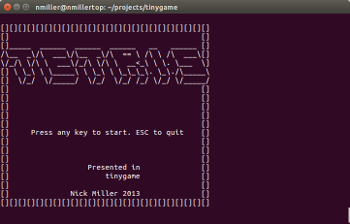
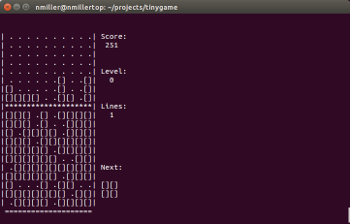
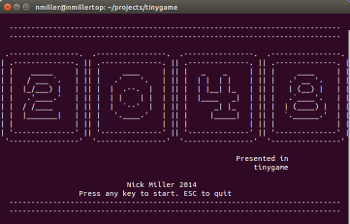
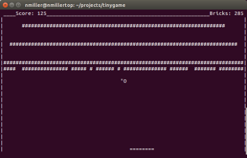
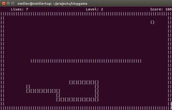

tinygame
========

An educational very lightweight literate programming library for creating simple text based games in Python. Includes tetris, 2048, flappy bird, nibbles, and breakout in examples. Intended for Raspberry Pi

screenshots
===========

 

 

 

 

